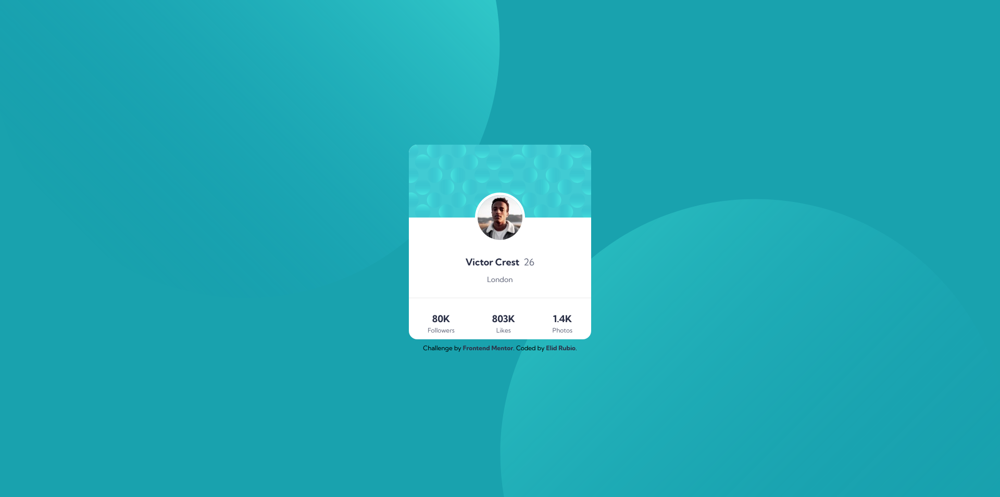
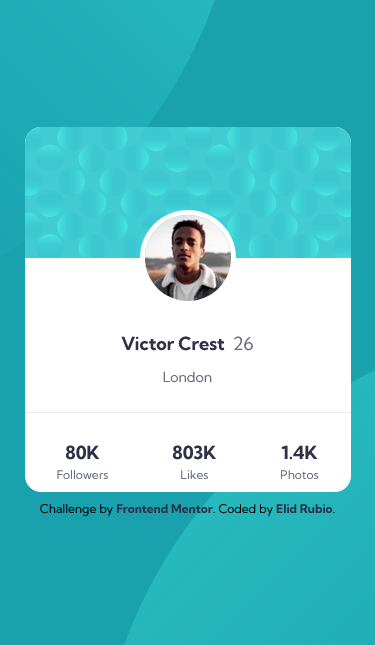

# Frontend Mentor - Profile card component solution

This is a solution to the [Profile card component challenge on Frontend Mentor](https://www.frontendmentor.io/challenges/profile-card-component-cfArpWshJ). Frontend Mentor challenges help you improve your coding skills by building realistic projects.

## Table of contents

- [Overview](#overview)
  - [The challenge](#the-challenge)
  - [Screenshot](#screenshot)
  - [Links](#links)
- [My process](#my-process)
  - [Built with](#built-with)
  - [Useful resources](#useful-resources)
- [Author](#author)

## Overview

### The challenge

Users should be able to:

- View the optimal layout depending on their device's screen size

### Screenshot

#### Desktop

#### Mobile

### Links

- [Solution URL](https://www.frontendmentor.io/solutions/profile-card-component-1aPoQF_yRn)
- [Live Site URL](https://elidrc.github.io/profile-card-component/)

## My process

### Built with

- HTML
- CSS
- Mobile First

### Useful resources

- [Youtube](https://www.youtube.com)
- [w3schools](https://www.w3schools.com)
- [StackOverflow](https://www.stackoverflow.com)
- [MDN Web Docs](https://developer.mozilla.org)

## Author

- Frontend Mentor - [@elidrc](https://www.frontendmentor.io/profile/elidrc)
